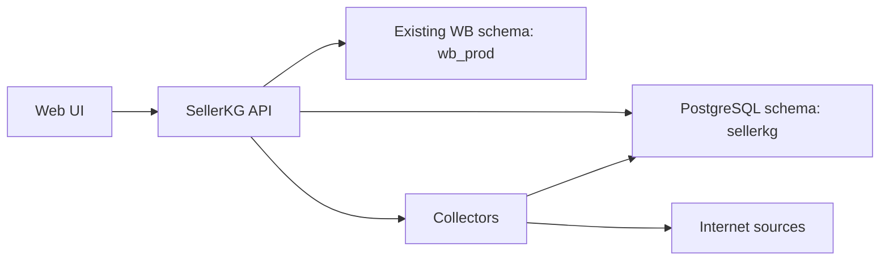

# SellerKG Architecture

Checked against official WB documentation on 2026-05-22:

- WB API information: https://dev.wildberries.ru/ru/openapi/api-information
- Analytics and Data: https://dev.wildberries.ru/en/openapi/analytics
- Reports: https://dev.wildberries.ru/en/openapi/reports

## Goal

SellerKG is an operational layer above marketplace data. It should not replace the existing loaders on day one. The first stable version reads their database tables, gives the seller a dedicated web console, and adds a controlled place for new collectors.

## Runtime Shape

## Boundaries

`WB_DATA_SCHEMA` is read-only from SellerKG's perspective. It is expected to be populated by existing services such as `load_WB_api`.

`APP_SCHEMA` is owned by SellerKG. It stores source definitions, collector runs, events, and external snapshots.

## Initial Modules

- Dashboard repository: reads orders, sales, finance views, and sync states.
- System repository: owns SellerKG service tables.
- Collector service: runs configured data sources manually or on interval.
- Web UI: surfaces seller metrics, top products, source state, and run history.

## Next Modules

- Official WB API collectors for analytics, reports, product content, prices, and stocks.
- Public product-card/market visibility collectors with explicit URL configuration.
- Authentication and role model.
- Alert rules for sync failures, low stock, margin changes, and API drift.
- Product detail pages with finance, ad spend, stock, content, and competitor signals.
